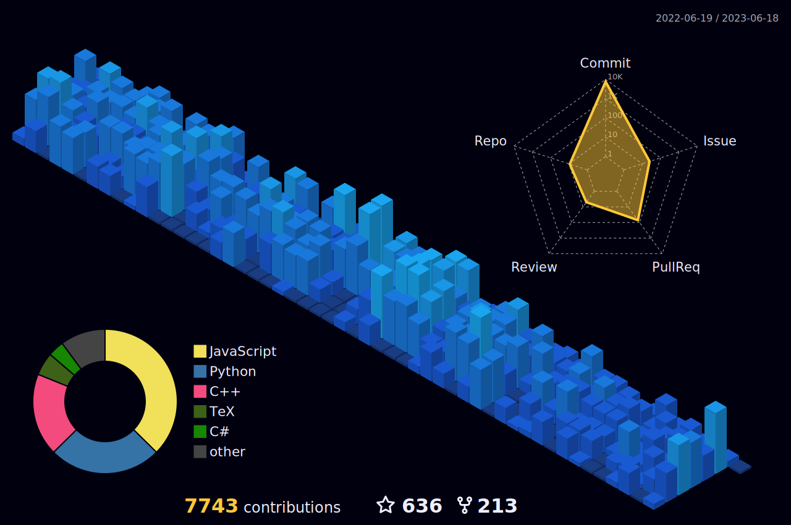

<!-- ppizarror README file -->
<!-- icons: https://github.com/alexandresanlim/Badges4-README.md-Profile -->

<h1 align="center">
  Hi there 👌 I'm Pablo
</h1>

<p align="center">
  M.Sc. student in Computer Science. Civil Engineer and M.Sc. in Structural Engineering
</p>

<p align="center">
  <a href="https://ppizarror.com">
    
  </a>
  <a href="mailto:pablo@ppizarror.com">
    
  </a>
  <a href="https://www.linkedin.com/in/ppizarror/">
    
  </a>
  <!---->
</p>

<p align="center">
  <a href="https://ppizarror.com" alt="ppizarror's Github Stats">
    
  </a>
</p>

## ℹ️ Info

- 👷 Software, R&D engineer @ <a href="https://github.com/IE3-CL">IE³ Structural Engineering</a>
- 🔗 Full stack web developer
- 🔭 I am currently researching automatic floor plan recognition at my M.Sc. in computer science @ <a href="https://www.dcc.uchile.cl/">dcc, UCH</a>
- 🎓 Experienced in Web Development, AI+ML+DL+CV+NLP, Computational Geometry, UI/UX, Structural Design, Construction Engineering & Data Science
- 🥁 Fun fact: I love video games, running, and drumming
<!-- - 📫 How to reach me: https://ppizarror.com -->

## 📊 Stats

<!-- 3D contribs -->


<!-- https://github.com/anuraghazra/github-readme-stats -->
<p align="left">
  <a href="https://ppizarror.com">
    
  </a>
</p>

<details>
  <summary>More stats</summary>
  <br />
  
  <a href="https://ppizarror.com" alt="Wakatime">
    
  </a>
  
<!--START_SECTION:waka-->


**🐱 My GitHub Data** 

> 🏆 1,630 Contributions in the Year 2023
 > 
> 📦 1.7 MB Used in GitHub's Storage 
 > 
> 💼 Opted to Hire
 > 
> 📜 74 Public Repositories 
 > 
> 🔑 13 Private Repositories  
 > 
**I'm an Early 🐤** 

```text
🌞 Morning      727 commits       ███░░░░░░░░░░░░░░░░░░░░░░   14.70 % 
🌆 Daytime     2110 commits       ██████████░░░░░░░░░░░░░░░   42.68 % 
🌃 Evening     1622 commits       ████████░░░░░░░░░░░░░░░░░   32.81 % 
🌙 Night        485 commits       ██░░░░░░░░░░░░░░░░░░░░░░░   09.81 % 

```
📅 **I'm Most Productive on Tuesday** 

```text
Monday         927 commits       ████░░░░░░░░░░░░░░░░░░░░░   18.75 % 
Tuesday        938 commits       ████░░░░░░░░░░░░░░░░░░░░░   18.97 % 
Wednesday      716 commits       ███░░░░░░░░░░░░░░░░░░░░░░   14.48 % 
Thursday       683 commits       ███░░░░░░░░░░░░░░░░░░░░░░   13.81 % 
Friday         707 commits       ███░░░░░░░░░░░░░░░░░░░░░░   14.30 % 
Saturday       437 commits       ██░░░░░░░░░░░░░░░░░░░░░░░   08.84 % 
Sunday         536 commits       ██░░░░░░░░░░░░░░░░░░░░░░░   10.84 % 

```


📊 **This Week I Spent My Time On** 

```text
⌚︎ Time Zone: America/Santiago

💬 Programming Languages: 
JavaScript               30 hrs 47 mins      █████████████░░░░░░░░░░░░   51.92 % 
PHP                      10 hrs 28 mins      ████░░░░░░░░░░░░░░░░░░░░░   17.67 % 
SCSS                     6 hrs 14 mins       ██░░░░░░░░░░░░░░░░░░░░░░░   10.51 % 
Python                   4 hrs 46 mins       ██░░░░░░░░░░░░░░░░░░░░░░░   08.07 % 
C++                      1 hr 43 mins        ░░░░░░░░░░░░░░░░░░░░░░░░░   02.92 % 

🔥 Editors: 
PhpStorm                 45 hrs 30 mins      ███████████████████░░░░░░   76.76 % 
VS Code                  6 hrs 45 mins       ██░░░░░░░░░░░░░░░░░░░░░░░   11.40 % 
PyCharm                  4 hrs 23 mins       █░░░░░░░░░░░░░░░░░░░░░░░░   07.41 % 
CLion                    2 hrs 37 mins       █░░░░░░░░░░░░░░░░░░░░░░░░   04.43 % 

🐱‍💻 Projects: 
TimeProj_Console         48 hrs 41 mins      ████████████████████░░░░░   82.13 % 
TimeProj                 3 hrs 48 mins       █░░░░░░░░░░░░░░░░░░░░░░░░   06.41 % 
DEHA-E2-RVTGRAPH         2 hrs 25 mins       █░░░░░░░░░░░░░░░░░░░░░░░░   04.09 % 
DEHA-E2-RVTGRAPH-VIEWER  1 hr 48 mins        ░░░░░░░░░░░░░░░░░░░░░░░░░   03.04 % 
pygame-menu              1 hr 13 mins        ░░░░░░░░░░░░░░░░░░░░░░░░░   02.07 % 

💻 Operating System: 
Windows                  59 hrs 20 mins      █████████████████████████   100.00 % 

```

**I Mostly Code in Python** 

```text
Python                   30 repos            ███████░░░░░░░░░░░░░░░░░░   31.25 % 
TeX                      26 repos            ██████░░░░░░░░░░░░░░░░░░░   27.08 % 
MATLAB                   13 repos            ███░░░░░░░░░░░░░░░░░░░░░░   13.54 % 
JavaScript               11 repos            ██░░░░░░░░░░░░░░░░░░░░░░░   11.46 % 
C++                      5 repos             █░░░░░░░░░░░░░░░░░░░░░░░░   05.21 % 

```


 Last Updated on 20/02/2023 18:35:04 UTC
<!--END_SECTION:waka-->
</details>

<!-- ## :zap: Recent activity -->
<!--START_SECTION:activity-->
<!--
1. 🗣 Commented on [#229](https://github.com/ppizarror/pygame-menu/issues/229) in [ppizarror/pygame-menu](https://github.com/ppizarror/pygame-menu)
2. 🗣 Commented on [#229](https://github.com/ppizarror/pygame-menu/issues/229) in [ppizarror/pygame-menu](https://github.com/ppizarror/pygame-menu)
3. 💪 Opened PR [#236](https://github.com/ppizarror/pygame-menu/pull/236) in [ppizarror/pygame-menu](https://github.com/ppizarror/pygame-menu)
4. 🗣 Commented on [#230](https://github.com/ppizarror/pygame-menu/issues/230) in [ppizarror/pygame-menu](https://github.com/ppizarror/pygame-menu)
5. 🗣 Commented on [#230](https://github.com/ppizarror/pygame-menu/issues/230) in [ppizarror/pygame-menu](https://github.com/ppizarror/pygame-menu)
-->
<!--END_SECTION:activity-->

<!--
## :trophy: GitHub Trophies
<!--
<p align="center">
  <a href="https://github.com/ryo-ma/github-profile-trophy">
    
  </a>
</p>
-->

## 💻 Languages / Frameworks

<p align="left">
  
  
  
  
  
  
  
  
  
  
  
  
  
  
  
  
  
  
  
  
  
  
  <!--  -->
  
  <!-- -->
</p>

## 🛠️ Tools

<p align="left">
  
  
  
  
  
  
</p>
